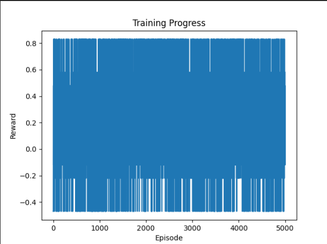
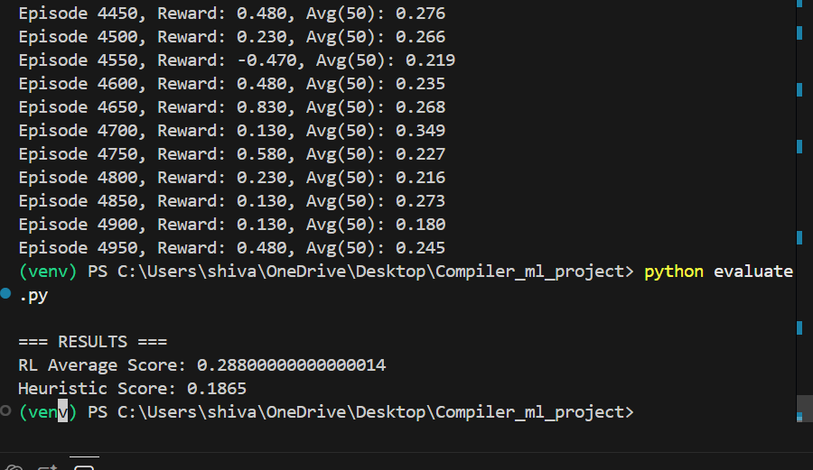

# Enhancing Compiler Optimization Using Reinforcement Learning

## Overview
This project explores how reinforcement learning (RL) can be used to improve compiler optimization decisions. Traditional compilers rely on fixed heuristics, which do not adapt well to different program structures.

In this project, compiler optimization is modeled as a sequential decision-making problem, where an RL agent learns to select the best optimization passes based on program features.

---

## Objective
- Replace static compiler heuristics with adaptive ML-based decisions  
- Learn optimization strategies dynamically  
- Improve performance over heuristic-based approaches  

---

## Approach

We model the problem using reinforcement learning (REINFORCE algorithm):

- State → Program features (loop depth, branching, instruction count)  
- Action → Optimization pass (inline, unroll, vectorize, etc.)  
- Reward → Performance improvement after applying optimization  

---

## Project Structure

compiler_ml_project/
│
├── env.py
├── model.py
├── train.py
├── evaluate.py
├── requirements.txt
└── README.md

---

## Training

The model is trained over multiple episodes where:
1. A program is generated  
2. The RL agent selects optimization passes  
3. Reward is computed  
4. The policy is updated  

---

## Training Results

### Training Progress

---

## Evaluation Results

RL Average Score: 0.288
Heuristic Score: 0.1865

The RL-based approach outperforms the heuristic baseline.

---

## Training Logs (Actual Output)

---

## Algorithm Used

- REINFORCE (Policy Gradient)  
- On-policy learning  
- Neural network-based policy  

---

## Key Features

- Adaptive optimization decisions  
- Sequential learning of optimization passes  
- Comparison with traditional heuristic approach  
- Modular design  

---

## Limitations

- Uses a simulated compiler environment  
- Limited feature representation  
- Not integrated with real compilers  

---

## Future Work

- Integration with LLVM  
- Graph Neural Networks (CFG-based representation)  
- Multi-objective optimization  
- Actor-Critic methods  

---

## Authors

Shivansh Dwivedi (BT23CSE124)  
Soumil Verma (BT23CSE137)  

Faculty: Dr. Khushboo Jain  
College: Indian Institute of Information Technology  

---

## Note

This project demonstrates that reinforcement learning can learn adaptive optim
